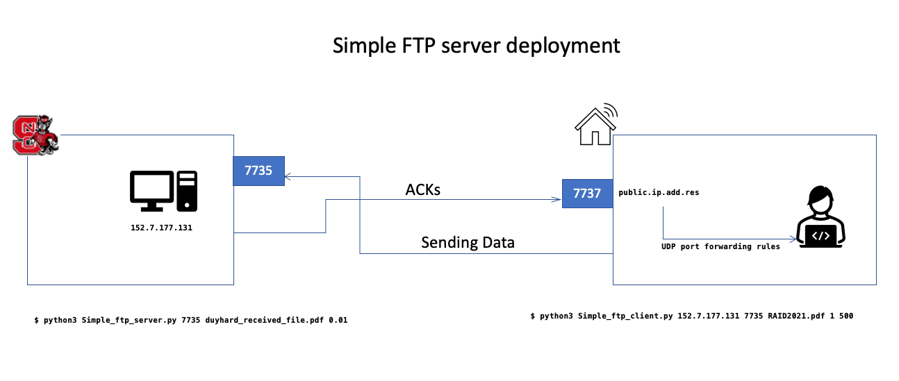

# Internet Protocols - Go-back-N automatic repeat request (ARQ) scheme

A very simple implementation of an FTP server based on Go-back-N automatic repeat request (ARQ) scheme.

Some highlighted features: 

encapsulating application data into transport layer segments by including transport headers, 
* buffering and managing data received from, or to be delivered to, the application,
* managing the window size at the sender,
* computing checksums, and
* using the UDP socket interface.

## Prerequisites

To run the program, make sure you have these prerequisites:

- Python3
- Two compute nodes, at least 3 hops away from each other. In this experiment, I use an Ubuntu box from NCSU's lab following [this link](https://vcl.ncsu.edu/scheduling/index.php?mode=viewRequests&offset=300) to host the server component, to which I connect from the client component running on my laptop (MacOS)
- The server obviously needs to be reachable from the client (both via UDP and TCP). This entails firewall configuration both sides (as needed) to allow the traffic between them

## Deployment overview

Here is the overview of the deployment  



## Run the program

Follow these steps to run the program:

First, place the file to be sent in the same directory with the `Simple_ftp_client.py` . This is to make sure the command will be executed sucessfully. 

### Run the server component on the server node

```code
$ python3 Simple_ftp_server.py port# file-name p
```
For example:

```code
$ python3 Simple_ftp_server.py 7735 duyhard_received_file.pdf 0.01
``` 

In this example, `duyhard_received_file.pdf` located in the same directory with the `Simple_ftp_server.py` is the resulting file received from the client component if everything goes well.

### Run the client component on the client node

```code
$ Simple_ftp_client server-host-name server-port# file-name N MSS
```
Again, before running this command, make sure `server-host-name` is reachable from the client node over both UDP and TCP. Also, the file to be transferred is readable by the client component. E.g: Place the file in the same directory with the `Simple_ftp_client.py`

For example:

```code
$ python3 Simple_ftp_client.py 152.7.177.131 7735 RAID2021.pdf 1 500
``` 

Notice that in this example, I am connecting to server `152.7.177.131` from my laptop over the internet, so it's a multiple-hop deployment

Now you can change the loss probability value (`p`) in the server component execution command, Window size value `N`, and the `MSS` value on the client side to experiment the effect of those values on the total delay of the file transferring process, especially when you transfer a large file. 

### Special settings with NCSU lab's boxes

In order to allow traffic in/out to/from NCSU lab's box, you probably need to make changes to the firewall

In this project, I use UDP/7735 for file transfer UDP/7737 for ACK transactions purpose

Enable UDP on port 7735: 

```code
$ sudo iptables -I INPUT -p udp -s 0.0.0.0/0 --dport 7735 -j ACCEPT
$ sudo ufw allow 7735
$ sudo ufw reload
```

Enable TCP on port 7737:

```code
$ sudo iptables -I INPUT -p udp -s 0.0.0.0/0 --dport 7737 -j ACCEPT
$ sudo ufw allow 7737
$ sudo ufw reload
```


## This is only some tricks for tunneling from TCP to UDP through ssh (not needed for the current settings)

Tunneling:

Local:

```code
$ ssh -L 65001:localhost:65001 dvnguye3@152.7.177.131
```

Server:
```code
mkfifo /tmp/fifo
nc -l -p 65001 < /tmp/fifo | nc localhost 7737 >/tmp/fifo
```

Local:
mkfifo /tmp/fifo
sudo nc -l 7737 -u  < /tmp/fifo | nc localhost 65001 >/tmp/fifo